# Chikitsa360 — Comprehensive Project Documentation

> **Version:** 1.0  
> **Last Updated:** February 23, 2026  
> **Repository:** [stuti-sharma17/Chikitsa360](https://github.com/stuti-sharma17/Chikitsa360)  
> **Branch:** `test` (default: `main`)

---

## Table of Contents

1. [Project Overview](#1-project-overview)
2. [High-Level Architecture](#2-high-level-architecture)
3. [Technology Stack](#3-technology-stack)
4. [Project Structure](#4-project-structure)
5. [Django Apps — Detailed Breakdown](#5-django-apps--detailed-breakdown)
   - 5.1 [auth_app — Authentication & User Management](#51-auth_app--authentication--user-management)
   - 5.2 [consultation_app — Appointments & Video Consultations](#52-consultation_app--appointments--video-consultations)
   - 5.3 [payment_app — Razorpay Payments & Receipts](#53-payment_app--razorpay-payments--receipts)
   - 5.4 [chat_app — Real-Time WebSocket Chat](#54-chat_app--real-time-websocket-chat)
   - 5.5 [transcription_app — Deepgram Audio Transcription](#55-transcription_app--deepgram-audio-transcription)
   - 5.6 [chatbot_app — AyurBot AI Chatbot](#56-chatbot_app--ayurbot-ai-chatbot)
6. [Database Schema (ER Diagram)](#6-database-schema-er-diagram)
7. [URL Routing Map](#7-url-routing-map)
8. [Frontend Architecture](#8-frontend-architecture)
9. [API Integrations](#9-api-integrations)
10. [Security & Middleware](#10-security--middleware)
11. [Deployment & Configuration](#11-deployment--configuration)
12. [Flow Diagrams](#12-flow-diagrams)
    - 12.1 [User Registration & Login Flow](#121-user-registration--login-flow)
    - 12.2 [Appointment Booking Flow](#122-appointment-booking-flow)
    - 12.3 [Video Consultation Flow](#123-video-consultation-flow)
    - 12.4 [Payment Flow](#124-payment-flow)
    - 12.5 [Chatbot Interaction Flow](#125-chatbot-interaction-flow)
    - 12.6 [Transcription Flow](#126-transcription-flow)
13. [Template Inventory](#13-template-inventory)
14. [Static Assets](#14-static-assets)
15. [Environment Variables](#15-environment-variables)
16. [Known Issues & TODOs](#16-known-issues--todos)

---

## Quick Summary

**Chikitsa360** is a full-stack telemedicine web application built with Django, connecting patients with doctors through video consultations. Patients search for doctors by specialty or availability, book appointments, and pay via Razorpay. Confirmed appointments enable real-time video calls (Daily.co WebRTC) with in-call text chat (Django Channels WebSocket). After each call, audio is automatically transcribed via Deepgram's speech-to-text API and emailed to both parties. An AI chatbot (AyurBot) powered by a LLaMA 2 7B model and Pinecone vector search answers Ayurvedic health queries using a RAG pipeline grounded in a medical reference book, with a fuzzy Q&A failsafe for instant responses. The chatbot also supports conversational appointment booking with emergency detection. The platform features role-based access (Patient/Doctor/Admin), Google Translate for 12 Indian languages, and is deployed on Koyeb with PostgreSQL.

**Tech stack at a glance:** Django 4 (ASGI/Daphne) · PostgreSQL · Django Channels · Daily.co · Razorpay · Deepgram · LLaMA 2 + Pinecone + LangChain · Tailwind CSS · Vanilla JS

---

## 1. Project Overview

**Chikitsa360** (Hindi: चिकित्सा = "medical treatment", 360 = "complete") is a full-stack telemedicine platform built with Django that connects patients with doctors for video consultations. The platform provides:

- **Role-based access** for Patients, Doctors, and Admins
- **Doctor discovery** — search by name, specialty, or availability date
- **Appointment booking** with availability slot management
- **Payment processing** via Razorpay (INR) with simulated dev mode
- **Video consultations** powered by Daily.co WebRTC
- **Real-time in-call chat** using Django Channels WebSockets
- **Post-call audio transcription** via Deepgram API with email delivery
- **AI-powered chatbot (AyurBot)** with fuzzy Q&A matching and conversational appointment booking
- **Multilingual support** via Google Translate widget
- **Ayurveda knowledge base** RAG chatbot using LLaMA 2 + Pinecone + LangChain

---

## 2. High-Level Architecture

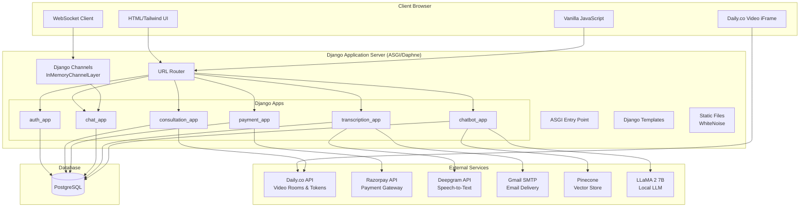

### Request/Response Lifecycle

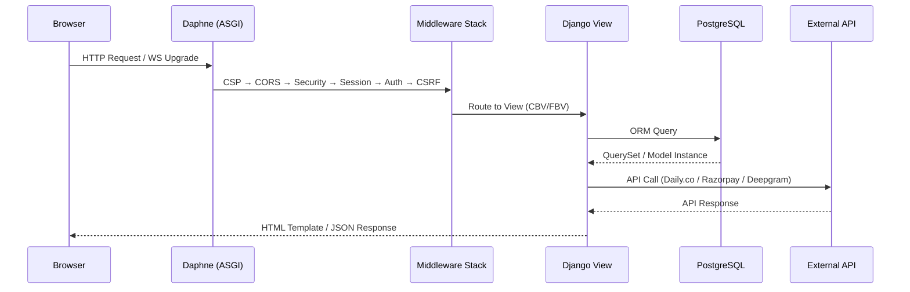

---

## 3. Technology Stack

| Layer | Technology | Version / Details |
|-------|-----------|-------------------|
| **Backend Framework** | Django | 4.x with ASGI |
| **ASGI Server** | Daphne | WebSocket + HTTP support |
| **Database** | PostgreSQL | via `psycopg2-binary` |
| **WebSockets** | Django Channels | `InMemoryChannelLayer` |
| **Video Calls** | Daily.co | WebRTC rooms + meeting tokens |
| **Payments** | Razorpay | INR currency, signature verification |
| **Speech-to-Text** | Deepgram API | audio/webm → text transcription |
| **AI / LLM** | LLaMA 2 7B Chat | GGML quantized (q4_0), via CTransformers |
| **Vector Store** | Pinecone | Semantic search for Ayurveda knowledge |
| **Embeddings** | Sentence Transformers | `all-MiniLM-L6-v2` HuggingFace model |
| **RAG Framework** | LangChain | `0.0.352` — RetrievalQA chain |
| **Frontend CSS** | Tailwind CSS | CDN (no build step) |
| **Icons** | Font Awesome | CDN |
| **JS** | Vanilla JavaScript | No framework |
| **Email** | Gmail SMTP | TLS on port 587 |
| **Static Files** | WhiteNoise | Serves compressed static in production |
| **Environment** | django-environ | `.env` file loading |
| **DB URLs** | dj-database-url | Production DATABASE_URL parsing |
| **Security** | django-csp | Content-Security-Policy headers |
| **CORS** | django-cors-headers | Cross-origin resource sharing |
| **Forms** | django-widget-tweaks | Template-level form field customization |
| **Translation** | Google Translate | Client-side widget in `base.html` |
| **OCR** | pytesseract | PDF / image text extraction (dependency) |

---

## 4. Project Structure

```
HackAndHeal/                         # Django project root
├── manage.py                        # Django management script
├── requirements.txt                 # Python dependencies
├── PROJECT_SUMMARY.md               # Brief project overview
├── CHIKITSA360_DOCUMENTATION.md     # This file
│
├── chikitsa360/                     # Django project configuration
│   ├── __init__.py
│   ├── settings.py                  # All settings, API keys, CSP, DB
│   ├── urls.py                      # Root URL routing
│   ├── asgi.py                      # ASGI config (Daphne + Channels)
│   └── wsgi.py                      # WSGI fallback
│
├── auth_app/                        # Authentication & user management
│   ├── models.py                    # User, Profile, DoctorProfile
│   ├── views.py                     # Login, Register, Dashboards, Profile
│   ├── forms.py                     # Registration, Login, Profile forms
│   ├── backends.py                  # Email authentication backend
│   ├── mixins.py                    # PatientRequired, DoctorRequired, AdminRequired
│   ├── urls.py                      # /auth/* routes
│   └── admin.py                     # Django admin registration
│
├── consultation_app/                # Appointments & video consultations
│   ├── models.py                    # Availability, Appointment, Service, Testimonial, HealthTip
│   ├── views.py                     # Home, Search, Book, Join, CRUD views
│   ├── forms.py                     # AvailabilityForm, AppointmentForm, DoctorSearchForm
│   ├── urls.py                      # /consultation/* + / (homepage)
│   ├── admin.py                     # Admin for all consultation models
│   └── templatetags/
│       └── form_filters.py          # Custom template filters
│
├── payment_app/                     # Payment processing
│   ├── models.py                    # Payment, Receipt
│   ├── views.py                     # Checkout, Callback, Receipt
│   ├── urls.py                      # /payment/* routes
│   └── admin.py                     # Admin registration
│
├── chat_app/                        # Real-time WebSocket chat
│   ├── models.py                    # ChatMessage
│   ├── consumers.py                 # ChatConsumer (AsyncWebsocketConsumer)
│   ├── routing.py                   # WebSocket URL routing
│   ├── views.py                     # Chat history API
│   └── urls.py                      # /chat/* routes
│
├── transcription_app/               # Audio transcription
│   ├── models.py                    # Transcription
│   ├── services.py                  # TranscriptionService (Deepgram + Email)
│   ├── views.py                     # Submit transcription endpoint
│   └── urls.py                      # /transcription/* routes
│
├── chatbot_app/                     # AI chatbot (AyurBot)
│   ├── views.py                     # Chat reply, booking API, preferences
│   ├── matcher.py                   # Fuzzy Q&A matching engine (724 lines)
│   ├── booking_flow.py              # Multi-turn booking state machine (513 lines)
│   ├── responses.py                 # Hardcoded Q&A knowledge base (817 lines)
│   ├── ai_service.py               # LLaMA 2 + Pinecone RAG chain
│   ├── prompt.py                    # LLM prompt template
│   ├── helper.py                    # HuggingFace embeddings loader
│   └── urls.py                      # /chatbot/* routes
│
├── AI chat/AyurvedaChatbot/         # Standalone Ayurveda RAG chatbot
│   ├── app.py                       # Flask/Streamlit app
│   ├── store_index.py               # Pinecone index builder
│   ├── data/                        # Ayurveda PDF knowledge base
│   ├── model/                       # LLaMA 2 GGML model files
│   └── src/                         # Helper modules
│
├── templates/                       # Django templates
│   ├── base.html                    # Master layout (navbar, footer, chatbot modal)
│   ├── index.html                   # Landing page
│   ├── doctor_search_results.html   # Doctor search results
│   ├── auth/                        # Login, Register templates
│   ├── doctor/                      # Doctor dashboard, appointments, detail
│   ├── patient/                     # Patient dashboard, appointments, booking
│   ├── consultation/                # Video room, availability, appointment detail
│   ├── payment/                     # Checkout, receipt, success
│   ├── chatbot/                     # Chatbot page template
│   ├── transcription/               # Email templates (patient + doctor)
│   ├── admin/                       # Custom admin templates
│   └── partials/                    # Reusable template fragments
│
├── static/                          # Source static files
│   ├── css/
│   │   ├── custom.css               # Global custom styles + CSS variables
│   │   └── tailwind.css             # Tailwind overrides
│   ├── js/
│   │   ├── main.js                  # Global JS utilities
│   │   ├── video.js                 # Daily.co video + audio recording (706 lines)
│   │   ├── chat.js                  # WebSocket chat client
│   │   ├── payment.js               # Razorpay integration
│   │   └── animations.js            # UI animations
│   └── images/                      # Static images & logos
│
└── staticfiles/                     # Collected static files (whitenoise)
```

---

## 5. Django Apps — Detailed Breakdown

### 5.1 auth_app — Authentication & User Management

#### Models

| Model | Fields | Purpose |
|-------|--------|---------|
| **User** | `email` (unique, USERNAME_FIELD), `role` (ADMIN/DOCTOR/PATIENT), `is_verified`, `username` (optional) | Custom AbstractUser with email-based auth |
| **Profile** | `user` (OneToOne), `profile_picture` (URL), `phone_number`, `address`, `date_of_birth` | Extended user information |
| **DoctorProfile** | `user` (OneToOne), `specialty`, `license_number`, `experience_years`, `bio`, `consultation_fee`, `education`, `hospital_affiliation`, `languages_spoken`, `is_available` | Doctor-specific professional details |

#### Authentication Flow

- **Backend:** `EmailBackend` — authenticates via email instead of username
- **Fallback:** Django's default `ModelBackend`
- **Custom Manager:** `UserManager` — handles `create_user()` and `create_superuser()` with email normalization

#### Views

| View | Type | URL | Purpose |
|------|------|-----|---------|
| `CustomLoginView` | LoginView (CBV) | `/auth/login/` | Email + password login, role-based redirect |
| `CustomLogoutView` | LogoutView (CBV) | `/auth/logout/` | Logout → redirect home |
| `RegisterView` | CreateView | `/auth/register/` | Self-registration with role selection; auto-creates Profile & DoctorProfile |
| `PatientDashboardView` | TemplateView | `/auth/dashboard/patient/` | Patient-specific dashboard |
| `DoctorDashboardView` | TemplateView | `/auth/dashboard/doctor/` | Doctor-specific dashboard |
| `AdminDashboardView` | TemplateView | `/auth/dashboard/admin/` | Admin dashboard (with user/doctor/patient counts) |
| `ProfileView` | DetailView | `/auth/profile/` | View own profile (includes doctor_profile if doctor) |
| `ProfileUpdateView` | UpdateView | `/auth/profile/edit/` | Edit profile (phone, address, DOB) |
| `DoctorProfileUpdateView` | UpdateView | `/auth/profile/doctor/update/` | Edit doctor professional info |

#### Access Control Mixins

| Mixin | Behavior |
|-------|----------|
| `PatientRequiredMixin` | Requires `user.role == PATIENT`, redirects to login if not |
| `DoctorRequiredMixin` | Requires `user.role == DOCTOR` |
| `AdminRequiredMixin` | Requires `user.role == ADMIN` |

All three extend `RoleRequiredMixin(UserPassesTestMixin)` which handles unauthenticated → login redirect and unauthorized → `PermissionDenied`.

#### Forms

| Form | Model | Key Details |
|------|-------|-------------|
| `CustomAuthenticationForm` | — | Extends `AuthenticationForm`, email field as username |
| `UserRegistrationForm` | User | Extends `UserCreationForm`; includes doctor-only fields (specialty, license_number, experience_years, consultation_fee, bio, education, hospital_affiliation, languages_spoken) with conditional validation; duplicate license check; `get_doctor_profile_data()` helper |
| `ProfileForm` | Profile | Fields: phone_number, address, date_of_birth |
| `DoctorProfileForm` | DoctorProfile | All 8 professional fields with Tailwind-styled widgets |
| `UserUpdateForm` | User | Fields: first_name, last_name, email |

#### Django Admin

- **UserAdmin**: Custom `BaseUserAdmin` with email-based fieldsets, `add_fieldsets` with email/password/role, ordered by email
- **ProfileAdmin**: `list_display` = user, phone_number, created_at
- **DoctorProfileAdmin**: `list_display` = user, specialty, experience_years, is_available; filterable by specialty

---

### 5.2 consultation_app — Appointments & Video Consultations

#### Models

| Model | Fields | Purpose |
|-------|--------|---------|
| **Availability** | `doctor` (FK→User), `date`, `start_time`, `end_time`, `is_booked` | Doctor's available time slots |
| **Appointment** | `id` (UUID), `patient` (FK→User), `doctor` (FK→User), `availability` (OneToOne), `appointment_date`, `appointment_time`, `status`, `reason`, `notes`, `video_room_id`, `video_room_token` | Core appointment record |
| **Service** | `name`, `description`, `icon_class`, `display_order`, `is_active` | Healthcare services displayed on homepage |
| **Testimonial** | `patient` (FK→User), `name`, `image`, `content`, `rating` (1-5), `is_featured`, `is_approved` | Patient reviews |
| **HealthTip** | `title`, `content`, `image_url`, `author` (FK→User), `is_featured` | Health articles for homepage |

#### Forms

| Form | Model | Purpose |
|------|-------|---------|
| `AvailabilityForm` | Availability | Date/start_time/end_time with validation (future date, start < end) |
| `AppointmentForm` | Appointment | Reason field only (other fields set by view) |
| `DoctorSearchForm` | — | Query (name/specialty), specialty filter, date filter |

#### Appointment Status Machine

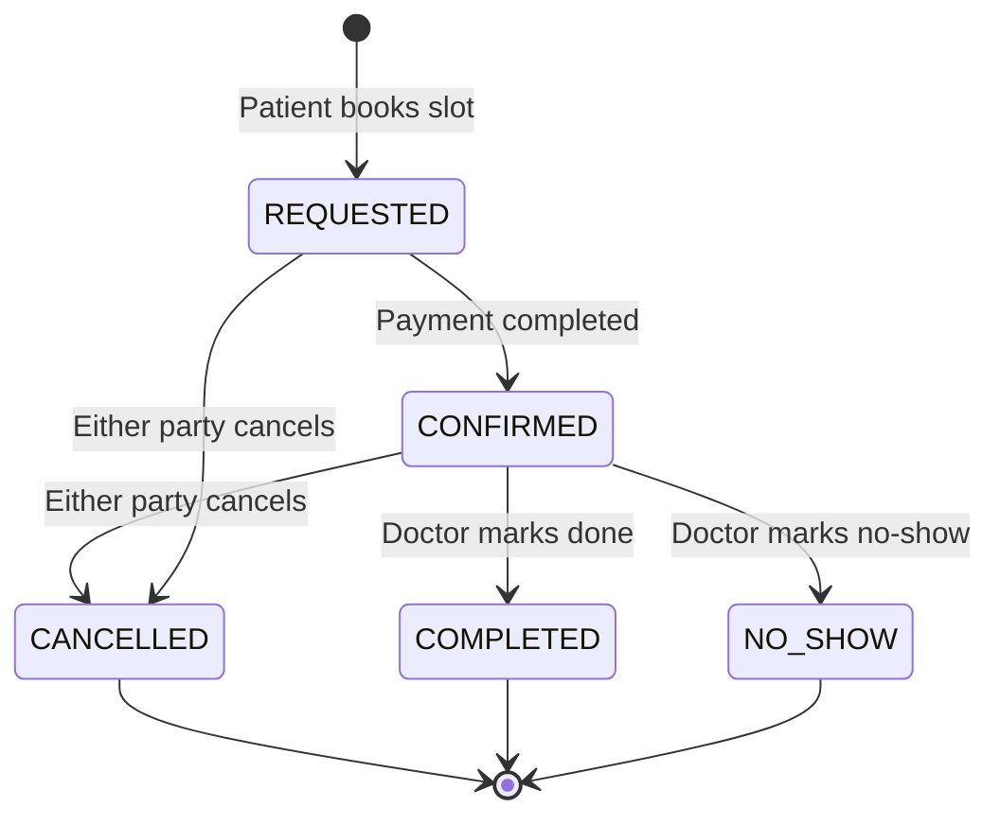

#### Computed Properties on Appointment

| Property | Logic |
|----------|-------|
| `is_past` | `appointment_datetime < now` |
| `is_today` | `appointment_date == today` |
| `can_join` | Status is CONFIRMED + today + within 15 min before to 1 hour after appointment time |

#### Views

| View | Type | URL | Purpose |
|------|------|-----|---------|
| `HomeView` | TemplateView | `/` | Landing page with stats, featured doctors (up to 6), services, testimonials, health tips, fallback tips |
| `DoctorSearchView` | ListView | `/doctors/search/` | Search doctors by name/specialty/date with pagination (10/page); filters out doctors without license_number |
| `DoctorDetailView` | DetailView | `/doctors/<pk>/` | Doctor profile + next 7 days availability |
| `AvailabilityCreateView` | CreateView | `/availability/create/` | Doctor creates a single availability slot |
| `AvailabilityDeleteView` | DeleteView | `/availability/<pk>/delete/` | Doctor deletes unbooked availability (permission checked) |
| `DoctorAvailabilityView` | View (GET/POST) | `/doctor/availability/` | Doctor manages all slots, grouped by date |
| `BookAppointmentView` | CreateView | `/appointment/book/<availability_id>/` | Patient books a slot → redirects to payment |
| `AppointmentDetailView` | DetailView | `/appointment/<uuid:pk>/` | Appointment details (both parties + admin) |
| `JoinConsultationView` | View | `/appointment/<uuid:pk>/join/` | Creates Daily.co room + token → renders video room |
| `PatientAppointmentsView` | ListView | `/patient/appointments/` | Patient's upcoming + past appointments |
| `DoctorAppointmentsView` | ListView | `/doctor/appointments/` | Doctor's today/upcoming/past appointments |
| `UpdateAppointmentStatusView` | View (POST) | `/appointment/<uuid:pk>/update-status/` | Doctor changes appointment status |
| `CancelAppointmentView` | View (POST) | `/appointment/<uuid:pk>/cancel/` | Cancel appointment + free slot |

> **Note:** There is also a duplicate route `consultation/join/<uuid:pk>/` → `JoinConsultationView` (named `join_video_call`).

#### Django Admin

- **AvailabilityAdmin**: `list_display` (doctor, date, times, is_booked), `date_hierarchy` on date
- **AppointmentAdmin**: `list_display` (id, patient, doctor, date, time, status), `date_hierarchy`, readonly id/timestamps
- **ServiceAdmin**: `list_display` with `list_editable` (display_order, is_active)
- **TestimonialAdmin**: `list_editable` (is_featured, is_approved), filterable by rating
- **HealthTipAdmin**: `list_editable` (is_featured), filterable by author

---

### 5.3 payment_app — Razorpay Payments & Receipts

#### Models

| Model | Fields | Purpose |
|-------|--------|---------|
| **Payment** | `id` (UUID), `appointment` (OneToOne), `patient` (FK), `amount`, `currency` (INR), `razorpay_order_id`, `razorpay_payment_id`, `razorpay_signature`, `status` | Payment tracking |
| **Receipt** | `id` (UUID), `payment` (OneToOne), `receipt_number`, `patient_name`, `doctor_name`, `appointment_date/time`, `amount`, `tax_amount` (18% GST), `total_amount`, `payment_date` | Generated receipt |

#### Payment Statuses

| Status | Description |
|--------|-------------|
| `PENDING` | Order created, awaiting payment |
| `COMPLETED` | Payment verified successfully |
| `FAILED` | Payment attempt failed |
| `REFUNDED` | Payment was refunded |

#### Dev Mode (RAZORPAY_ENABLED = False)

When Razorpay is disabled, the checkout view:
1. Creates a `Payment` with `SIMULATED_ORDER_ID`
2. Marks it as `COMPLETED` immediately
3. Confirms the appointment
4. Redirects to appointment detail

#### Production Mode (RAZORPAY_ENABLED = True)

1. Creates a Razorpay order via API
2. Renders checkout page with Razorpay JS modal
3. Razorpay sends callback POST to `/payment/callback/`
4. Server verifies `razorpay_signature` using HMAC
5. Marks payment as COMPLETED, appointment as CONFIRMED
6. Generates receipt with 18% GST calculation

#### Views

| View | URL | Purpose |
|------|-----|---------|
| `PaymentCheckoutView` | `/payment/checkout/<appointment_id>/` | Initiate payment (simulated or Razorpay) |
| `PaymentCallbackView` | `/payment/callback/` | Razorpay webhook (CSRF exempt) |
| `ReceiptDetailView` | `/payment/receipt/<pk>/` | View payment receipt |

---

### 5.4 chat_app — Real-Time WebSocket Chat

#### Model

**ChatMessage:** `appointment` (FK→Appointment), `sender` (FK→User), `message`, `is_read`, `created_at`

#### WebSocket Architecture

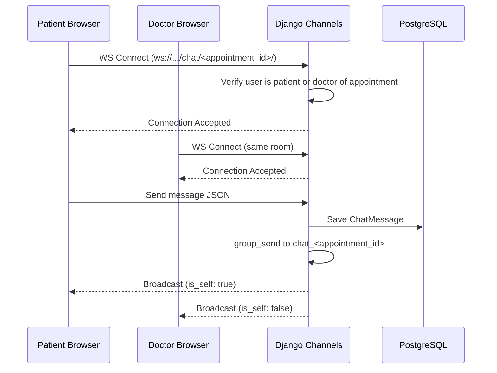

#### Consumer: `ChatConsumer` (AsyncWebsocketConsumer)

| Method | Purpose |
|--------|---------|
| `connect()` | Validates user permission, joins `chat_<appointment_id>` group |
| `disconnect()` | Leaves the channel group |
| `receive()` | Parses JSON message, saves to DB, broadcasts to group |
| `chat_message()` | Sends message to individual WebSocket with `is_self` flag |
| `user_can_access_appointment()` | DB check: user must be patient or doctor of appointment |

#### HTTP Views

| View | URL | Purpose |
|------|-----|---------|
| `ChatHistoryView` | `/chat/appointment/<uuid:appointment_id>/` | ListView — renders full chat history, marks unread messages as read |
| `LoadMessagesView` | `/chat/appointment/<uuid:appointment_id>/messages/` | AJAX GET — returns new messages since `last_message_id` as JSON, marks unread as read |

#### Routing

```python
# chat_app/routing.py
websocket_urlpatterns = [
    path('ws/chat/<uuid:appointment_id>/', ChatConsumer.as_asgi()),
]
```

---

### 5.5 transcription_app — Deepgram Audio Transcription

#### Model

**Transcription:** `id` (UUID), `appointment` (OneToOne→Appointment), `content`, `status` (PENDING/PROCESSING/COMPLETED/FAILED), `error_message`, `audio_duration`

#### Transcription Pipeline

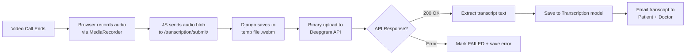

#### Views

| View | Type | URL | Purpose |
|------|------|-----|---------|
| `TranscriptionCreateView` | View (POST) | `/transcription/create/<uuid:appointment_id>/` | Accepts audio file upload (`audio_data`), creates/retries Transcription, calls `process_audio()` |
| `TranscriptionStatusView` | View (GET) | `/transcription/status/<uuid:transcription_id>/` | Returns JSON status (status, completed, failed, error_message, timestamps) |
| `TranscriptionDetailView` | DetailView | `/transcription/detail/<uuid:pk>/` | Renders transcription detail page |

#### TranscriptionService Methods

| Method | Purpose |
|--------|---------|
| `process_audio(audio_data, transcription)` | Saves audio to cross-platform temp dir, sends to Deepgram, parses response, triggers email |
| `send_transcription_emails(transcription)` | Renders HTML email templates, sends to both patient and doctor via Gmail SMTP |

#### Deepgram API Configuration

- **Endpoint:** `https://api.deepgram.com/v1/listen`
- **Content-Type:** `audio/webm`
- **Parameters:** `model=general`, `language=en-US`, `detect_language=true`, `punctuate=true`, `utterances=true`

---

### 5.6 AyurBot — AI Chatbot (Core + Django Integration)

AyurBot is the platform's AI assistant. The **primary implementation** is a **Retrieval-Augmented Generation (RAG) pipeline** built in `AI chat/AyurvedaChatbot/`, which was originally a standalone Flask app and has been integrated into the Django project via `chatbot_app/ai_service.py`. The hardcoded Q&A matcher in `chatbot_app/` serves as a **fast failsafe** for common questions and platform queries when the LLM is unavailable.

#### Architecture Overview

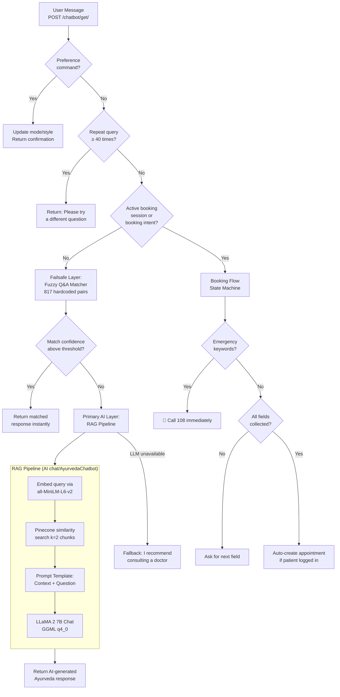

---

#### Primary AI Layer — `AI chat/AyurvedaChatbot/` (RAG Pipeline)

This is the **core chatbot implementation** — a complete RAG system that retrieves information from an authoritative Ayurvedic medical book and generates responses using a local LLM.

##### Knowledge Base & Indexing (`store_index.py`)

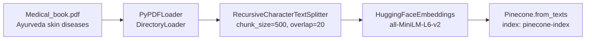

| Component | Implementation | Details |
|-----------|---------------|---------|
| **Knowledge Source** | `data/Medical_book.pdf` | Authoritative Ayurvedic reference book on skin diseases |
| **PDF Loading** | `PyPDFLoader` via `DirectoryLoader` | Extracts text from all PDFs in `data/` folder |
| **Text Splitting** | `RecursiveCharacterTextSplitter` | chunk_size=500 chars, chunk_overlap=20 chars |
| **Embeddings** | `sentence-transformers/all-MiniLM-L6-v2` | HuggingFace model, produces 384-dim vectors |
| **Vector Store** | Pinecone cloud (`pinecone-index`) | Stores chunk embeddings for similarity search |
| **Indexing Script** | `store_index.py` | One-time script to build/rebuild the Pinecone index |

##### Query & Response Pipeline (`app.py`)

| Step | Component | Details |
|------|-----------|---------|
| 1. **Query Embedding** | Same `all-MiniLM-L6-v2` model | User question → 384-dim vector |
| 2. **Similarity Search** | Pinecone retriever, `k=2` | Top 2 most relevant text chunks retrieved |
| 3. **Prompt Construction** | `PromptTemplate` | Injects retrieved context + user question |
| 4. **LLM Generation** | LLaMA 2 7B Chat (GGML q4_0) | `max_new_tokens=512`, `temperature=0.6` |
| 5. **Answer Extraction** | LangChain `RetrievalQA` chain | `stuff` chain type — all context concatenated |

##### Prompt Template

```
Use the following pieces of information to answer the user's question.
If you don't know the answer, just say that you don't know, don't try to make up an answer.

Context: {context}
Question: {question}

Only return the helpful answer below and nothing else.
Helpful answer:
```

##### LLM Model

| Property | Value |
|----------|-------|
| Model | LLaMA 2 7B Chat |
| Format | GGML v3 quantized (q4_0) |
| File | `llama-2-7b-chat.ggmlv3.q4_0.bin` (~4GB) |
| Source | [TheBloke/Llama-2-7B-Chat-GGML](https://huggingface.co/TheBloke/Llama-2-7B-Chat-GGML) |
| Runtime | CTransformers (Python bindings for GGML) |
| Location | `AI chat/AyurvedaChatbot/model/` |

##### Original Standalone App (`app.py`)

The RAG chatbot was originally built as a **standalone Flask web app** with its own UI:

| Component | Details |
|-----------|---------|
| Framework | Flask (`app.run(host="0.0.0.0", port=8080)`) |
| Endpoint | `POST /get` — accepts `msg` form field, returns AI answer as text |
| Frontend | `templates/chat.html` — Bootstrap 4 chat interface ("AyurAssist") with jQuery AJAX |
| Styles | `static/style.css` — Chat bubble styles |
| Authors | Tatwansh & Tenzin (see `setup.py`) |

##### File Structure

```
AI chat/AyurvedaChatbot/
├── app.py                  # Flask app — standalone chatbot server
├── store_index.py          # One-time: PDF → chunks → Pinecone embeddings
├── setup.py                # Package metadata (Tatwansh & Tenzin)
├── README.md               # Full methodology documentation
├── data/
│   └── Medical_book.pdf    # Ayurveda skin diseases reference book
├── model/
│   ├── instruction.txt     # Download link for LLaMA 2 model
│   └── (llama-2-7b-chat.ggmlv3.q4_0.bin)  # ~4GB, not in git
├── research/
│   └── trials.ipynb        # Jupyter notebook with experiments
├── src/
│   ├── __init__.py
│   ├── helper.py           # load_pdf(), text_split(), download_hugging_face_embeddings()
│   └── prompt.py           # Prompt template string
├── static/
│   └── style.css           # Chat UI styles
└── templates/
    └── chat.html           # Bootstrap chat interface (jQuery)
```

---

#### Django Integration — `chatbot_app/ai_service.py`

The standalone Flask chatbot was integrated into Django through `ai_service.py`, which wraps the same RAG pipeline:

| Feature | Implementation |
|---------|---------------|
| **Entry point** | `get_qa_chain()` — returns the LangChain `RetrievalQA` chain |
| **Lazy loading** | Global `_qa_chain` cached after first call — avoids reloading 4GB model per request |
| **Model path resolution** | `LLM_MODEL_PATH` env var → falls back to `AI chat/AyurvedaChatbot/model/llama-2-7b-chat.ggmlv3.q4_0.bin` |
| **Error handling** | `ChatbotConfigError` raised if Pinecone keys missing, model file not found, or dependencies unavailable |
| **Dependency imports** | Lazy `import` inside function — so Django starts even if LLM deps are missing |
| **Shared code** | Reuses `helper.py` (embeddings) and `prompt.py` (template) from `chatbot_app/` (mirrors of `AI chat/AyurvedaChatbot/src/`) |

---

#### Failsafe Layer — Fuzzy Q&A Matcher (`chatbot_app/matcher.py` + `responses.py`)

When the LLM is unavailable (model not downloaded, Pinecone not configured, or insufficient RAM), the chatbot falls back to a **fast rule-based matcher**:

| Component | Size | Purpose |
|-----------|------|---------|
| `responses.py` | 817 lines | 817 hardcoded Q&A pairs covering greetings, platform features, medical specialties, Ayurveda topics, emergency guidance, mental health, lifestyle, nutrition |
| `matcher.py` | 724 lines | Sophisticated fuzzy matching engine: TF-IDF cosine similarity, keyword overlap, N-gram matching (bigrams + trigrams), synonym expansion, intent classification, context-aware follow-up |

This failsafe ensures the chatbot **always returns something useful** — even on machines that can't run the 4GB LLM.

---

#### Booking Flow (`chatbot_app/booking_flow.py` — 513 lines)

A **multi-turn conversational state machine** that collects appointment details step-by-step, independent of the AI/failsafe layers:

**Fields collected in order:** `name` → `age` → `gender` → `contactNumber` → `symptoms` → `preferredDate` → `preferredTime` → `location` → `visitType`

**Features:**
- Session state stored in Django cache with TTL (1 hour), key prefix: `chatbot_booking_session:`
- Emergency keyword detection (chest pain, breathing issue, seizure, etc.) → immediate 108 helpline response
- Symptom-to-specialization mapping (e.g., "chest pain" → Cardiologist)
- Auto-specialization recommendation after symptoms collected
- Date/time parsing with validation
- Gender normalization (m/male/f/female/o/other)
- JSON booking summary at completion
- **Auto-appointment creation** if patient is logged in (calls `_create_ai_appointment_from_payload()`)

---

#### Chatbot Views (`chatbot_app/views.py` — 547 lines)

| Endpoint | Method | Name | Purpose |
|----------|--------|------|---------| 
| `/chatbot/` | GET | `chatbot_page` | Redirects to `/?chatbot=open` |
| `/chatbot/get/` | POST (AJAX) | `chatbot_reply` | Main entry point — preference commands → booking flow → failsafe matcher → RAG pipeline |
| `/chatbot/quick-book/` | POST | `chatbot_quick_book` | Quick-book an appointment from chatbot |
| `/chatbot/ai-booking/` | POST | `ai_booking_converse` | AI-powered multi-turn booking conversation |
| `/api/appointments/` | POST | `api_appointments` | Creates appointment from chatbot booking (root URL) |

#### Session & Preference Features

- **Repeat detection:** Tracks normalized query counts per session (limit: 40 for same query)
- **Response mode preferences:** `short` / `medium` / `detailed` — set via chat commands (e.g., `mode detailed`)
- **Language style:** `english` / `hinglish` — set via chat commands (e.g., `style hinglish`)
- **Chat commands:** `mode <x>`, `style <x>`, `format <x> <y>`, `show format`
- **Booking session persistence** via Django cache with 1-hour TTL

---

## 6. Database Schema (ER Diagram)

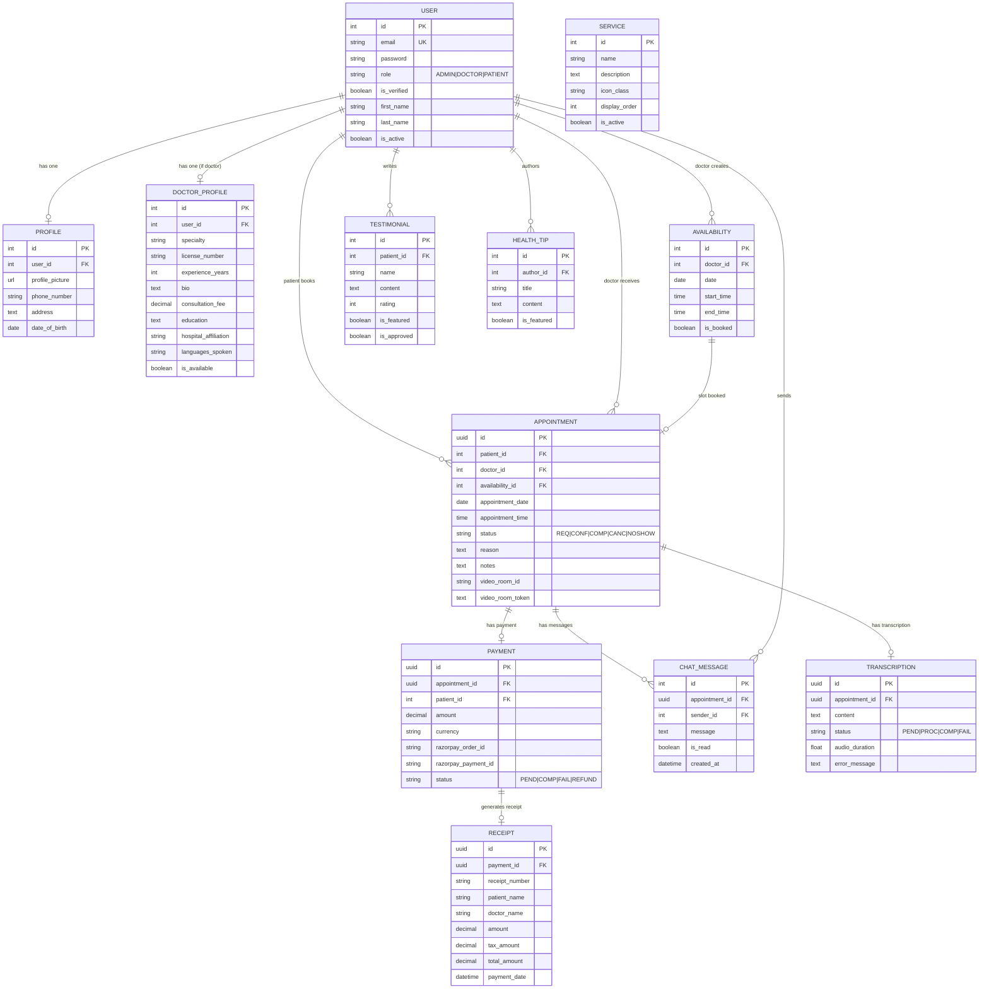

---

## 7. URL Routing Map

### Root URLs (`chikitsa360/urls.py`)

| Prefix | App | Description |
|--------|-----|-------------|
| `/admin/` | Django Admin | Built-in admin interface |
| `/auth/` | `auth_app` | Login, register, profile, dashboards |
| `/consultation/` | `consultation_app` | Appointments, availability, video room |
| `/payment/` | `payment_app` | Checkout, callback, receipt |
| `/chat/` | `chat_app` | Chat history API |
| `/chatbot/` | `chatbot_app` | AI chatbot reply + booking APIs |
| `/transcription/` | `transcription_app` | Audio submission endpoint |
| `/api/appointments/` | `chatbot_app` | Direct appointment creation API |
| `/` | `consultation_app` | Landing page (HomeView) |

### WebSocket URLs (`chat_app/routing.py`)

| Pattern | Consumer | Description |
|---------|----------|-------------|
| `ws/chat/<appointment_id>/` | `ChatConsumer` | Real-time in-call chat |

---

## 8. Frontend Architecture

### Template Hierarchy

```mermaid
graph TD
    BASE[base.html<br/>964 lines] --> INDEX[index.html<br/>Landing Page]
    BASE --> SEARCH[doctor_search_results.html]
    BASE --> AUTH_TEMPLATES[auth/*.html]
    BASE --> DOCTOR_TEMPLATES[doctor/*.html]
    BASE --> PATIENT_TEMPLATES[patient/*.html]
    BASE --> CONSULT_TEMPLATES[consultation/*.html]
    BASE --> PAYMENT_TEMPLATES[payment/*.html]

    AUTH_TEMPLATES --> LOGIN[login.html]
    AUTH_TEMPLATES --> REGISTER[register.html]
    AUTH_TEMPLATES --> PROFILE[profile.html]

    DOCTOR_TEMPLATES --> DR_DASH[doctor_dashboard.html]
    DOCTOR_TEMPLATES --> DR_APPT[doctor_appointments.html]
    DOCTOR_TEMPLATES --> DR_DETAIL[doctor_detail.html]

    PATIENT_TEMPLATES --> PT_DASH[patient_dashboard.html]
    PATIENT_TEMPLATES --> PT_APPT[patient_appointments.html]
    PATIENT_TEMPLATES --> BOOK[book_appointment.html]

    CONSULT_TEMPLATES --> VIDEO[video_room.html]
    CONSULT_TEMPLATES --> AVAIL[doctor_availability.html]
    CONSULT_TEMPLATES --> APPT_DETAIL[appointment_detail.html]

    PAYMENT_TEMPLATES --> CHECKOUT[checkout.html]
    PAYMENT_TEMPLATES --> RECEIPT[receipt.html]
```

### `base.html` — Master Template (964 lines)

Contains:
- **Responsive navbar** with role-based menu items (Patient/Doctor/Admin/Guest)
- **Footer** with site info and links
- **Google Translate widget** integration (client-side translation)
- **AyurBot chatbot modal** — floating button + chat overlay
- **Tailwind CSS CDN** + Font Awesome CDN
- **CSRF token** meta tag for AJAX
- **Block slots:** `title`, `extra_head`, `content`, `extra_js`

### JavaScript Modules

| File | Lines | Purpose |
|------|-------|---------|
| `video.js` | 706 | Daily.co call lifecycle: `initializeCall()`, `endCall()`, camera/mic toggles, `MediaRecorder` for audio capture, `submitTranscription()`, in-call chat via `initializeChat()` |
| `chat.js` | — | WebSocket client: connects to `ws://.../chat/<id>/`, sends/receives JSON, DOM updates |
| `payment.js` | — | Razorpay checkout modal integration |
| `main.js` | — | Global utilities (mobile menu toggle, form enhancements) |
| `animations.js` | — | Scroll-triggered animations, page transitions |

### CSS Architecture

- **Tailwind CSS (CDN):** Utility-first classes applied directly in templates
- **`custom.css`:** CSS custom properties (variables) for brand colors, component classes:
  - `.c360-btn-primary` / `.c360-btn-secondary` — Button styles
  - `.c360-card` — Card component
  - `.c360-logo` — Navbar logo sizing
  - `.doctor-card` — Doctor search result card
  - Color variables: primary (#0891b2 cyan), secondary, accent colors

---

## 9. API Integrations

### 9.1 Daily.co (Video Calls)

| Operation | Endpoint | Method | When |
|-----------|----------|--------|------|
| Create Room | `https://api.daily.co/v1/rooms` | POST | Patient/Doctor joins consultation |
| Generate Token | `https://api.daily.co/v1/meeting-tokens` | POST | After room creation |

**Room Properties:** `enable_chat: true`, `start_audio_off: false`, `start_video_off: false`, `exp: now + 2 hours`

**Client-side:** Daily.co JavaScript SDK loaded via `<script>` in `video_room.html`, managed by `video.js`

### 9.2 Razorpay (Payments)

| Operation | Where | Details |
|-----------|-------|---------|
| Create Order | `PaymentCheckoutView` | Amount in paisa (×100), INR, appointment metadata |
| Verify Signature | `PaymentCallbackView` | HMAC-SHA256 verification of `razorpay_signature` |
| Client Modal | `checkout.html` + `payment.js` | Razorpay Checkout.js popup |

### 9.3 Deepgram (Speech-to-Text)

| Config | Value |
|--------|-------|
| API Endpoint | `https://api.deepgram.com/v1/listen` |
| Auth Header | `Token <DEEPGRAM_API_KEY>` |
| Content-Type | `audio/webm` (binary upload) |
| Model | `general` |
| Features | Language detection, punctuation, utterances |

### 9.4 Google Translate (Client-Side)

- Loaded in `base.html` via `translate.google.com/translate_a/element.js`
- Languages: English, Hindi, Bengali, Tamil, Telugu, Marathi, Gujarati, Kannada, Malayalam, Punjabi, Urdu, Odia
- Widget rendered in `#google_translate_element` div

### 9.5 Pinecone + LLaMA 2 (AI Chatbot — Primary Intelligence)

The core chatbot implementation lives in `AI chat/AyurvedaChatbot/` and is integrated into Django via `chatbot_app/ai_service.py`.

| Component | Details |
|-----------|---------|
| **Knowledge Source** | `data/Medical_book.pdf` — Ayurvedic reference book on skin diseases |
| **Indexing** | `store_index.py` — PDF → `RecursiveCharacterTextSplitter` (500 chars, 20 overlap) → Pinecone |
| **Vector Store** | Pinecone cloud index (`pinecone-index`) |
| **Embeddings** | `sentence-transformers/all-MiniLM-L6-v2` (384-dim) via HuggingFace |
| **LLM** | LLaMA 2 7B Chat GGML (q4_0 quantization, ~4 GB), loaded via CTransformers |
| **Chain** | LangChain `RetrievalQA` → `stuff` chain, k=2 docs, `max_new_tokens=512`, `temperature=0.6` |
| **Prompt** | Context + Question → "Only return the helpful answer" |
| **Django Integration** | `chatbot_app/ai_service.py` — lazy-loaded `get_qa_chain()` with global cache |
| **Failsafe** | `chatbot_app/matcher.py` + `responses.py` — 817 hardcoded Q&A pairs with fuzzy matching |
| **Original App** | Standalone Flask app (`app.py`) at port 8080 with Bootstrap chat UI |

---

## 10. Security & Middleware

### Middleware Stack (applied in order)

```
1. CSPMiddleware          — Content-Security-Policy headers
2. CorsMiddleware         — Cross-Origin Resource Sharing
3. SecurityMiddleware     — HTTPS redirects, HSTS (production)
4. SessionMiddleware      — Server-side sessions
5. CommonMiddleware       — URL normalization
6. CsrfViewMiddleware     — CSRF protection
7. AuthenticationMiddleware — User authentication
8. MessageMiddleware      — Flash messages
9. XFrameOptionsMiddleware — Clickjacking protection
10. WhiteNoiseMiddleware   — Static file serving
```

### Content-Security-Policy (CSP) Directives

| Directive | Allowed Sources |
|-----------|----------------|
| `default-src` | `'self'` |
| `script-src` | `'self'`, `'unsafe-inline'`, Tailwind CDN, Font Awesome, Daily.co, Google Translate |
| `style-src` | `'self'`, `'unsafe-inline'`, Google Fonts, Tailwind CDN, Font Awesome |
| `img-src` | `'self'`, `data:`, Unsplash, `https://*` |
| `connect-src` | `'self'`, Daily.co, Google Translate APIs |
| `frame-src` | `'self'`, Daily.co, Google Translate |
| `media-src` | `'self'`, Daily.co |

### Production Security Settings

| Setting | Value |
|---------|-------|
| `SECURE_SSL_REDIRECT` | `True` |
| `SESSION_COOKIE_SECURE` | `True` |
| `CSRF_COOKIE_SECURE` | `True` |
| `SECURE_BROWSER_XSS_FILTER` | `True` |
| `SECURE_CONTENT_TYPE_NOSNIFF` | `True` |
| `X_FRAME_OPTIONS` | `DENY` |
| `SESSION_COOKIE_SAMESITE` | `Lax` |
| `SECURE_REFERRER_POLICY` | `strict-origin-when-cross-origin` |

### Password Validation

Django's 4 built-in validators: `UserAttributeSimilarityValidator`, `MinimumLengthValidator`, `CommonPasswordValidator`, `NumericPasswordValidator`

---

## 11. Deployment & Configuration

### Runtime Configuration

| Setting | Value |
|---------|-------|
| ASGI Application | `chikitsa360.asgi.application` |
| Server | Daphne (ASGI) / Gunicorn (WSGI fallback) |
| Database | PostgreSQL (dev: local, prod: `DATABASE_URL` via `dj-database-url`) |
| Time Zone | `Asia/Kolkata` (IST) |
| Static Files | WhiteNoise (auto-compress + cache headers) |
| Channel Layer | `InMemoryChannelLayer` (single-process; upgrade to Redis for multi-process) |

### Hosting

| Environment | Host | URL |
|-------------|------|-----|
| Production | Koyeb | `https://helpless-trixy-siddharthrepo-de886f3f.koyeb.app` |
| Development | Localhost | `http://127.0.0.1:8000` |

### Database Configuration

**Development:**
```python
{
    'ENGINE': 'django.db.backends.postgresql',
    'NAME': env('PGDATABASE', 'chikitsa360'),
    'USER': env('PGUSER', 'postgres'),
    'PASSWORD': env('PGPASSWORD'),
    'HOST': env('PGHOST', 'localhost'),
    'PORT': env('PGPORT', '5432'),
}
```

**Production:** `dj_database_url.config(default=DATABASE_URL)`

---

## 12. Flow Diagrams

### 12.1 User Registration & Login Flow

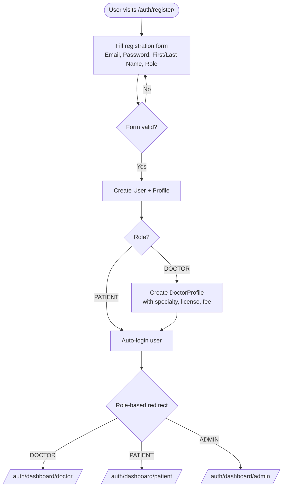

### 12.2 Appointment Booking Flow

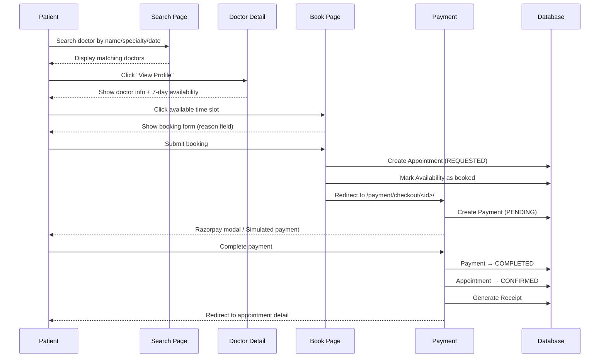

### 12.3 Video Consultation Flow

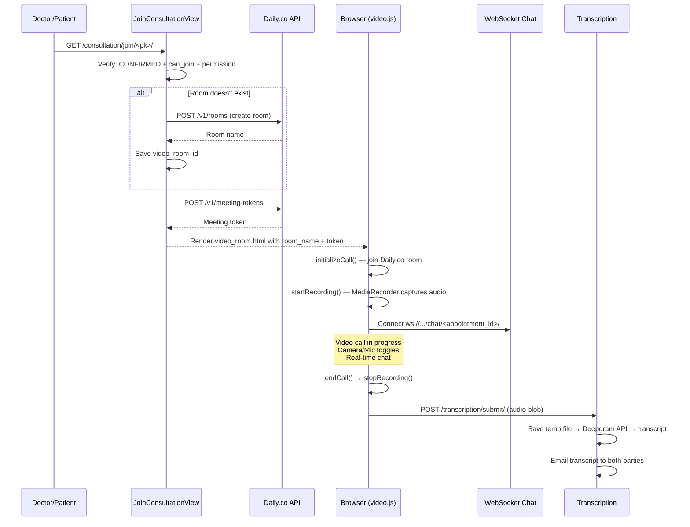

### 12.4 Payment Flow

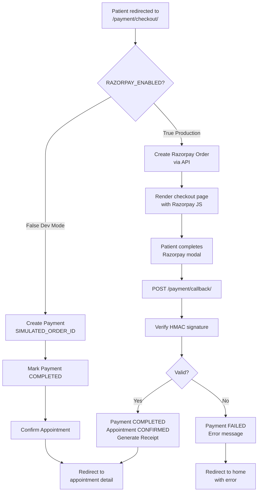

### 12.5 Chatbot Interaction Flow

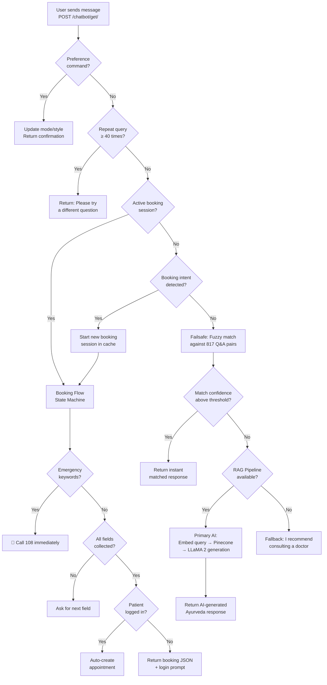

### 12.6 Transcription Flow

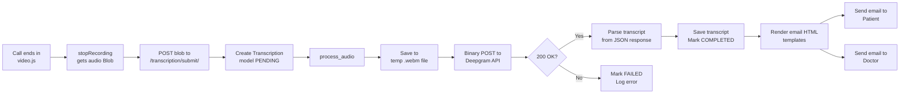

---

## 13. Template Inventory

| Directory | Templates | Purpose |
|-----------|-----------|---------|
| `templates/` | `base.html`, `index.html`, `doctor_search_results.html` | Root layouts and pages |
| `templates/auth/` | `login.html`, `register.html`, `profile.html`, `edit_profile.html`, `update_doctor_profile.html` | Authentication pages |
| `templates/doctor/` | `doctor_dashboard.html`, `doctor_appointments.html`, `doctor_detail.html` | Doctor-facing pages |
| `templates/patient/` | `patient_dashboard.html`, `patient_appointments.html`, `book_appointment.html` | Patient-facing pages |
| `templates/consultation/` | `video_room.html`, `doctor_availability.html`, `appointment_detail.html`, `patient_appointments.html` | Consultation flow |
| `templates/payment/` | `checkout.html`, `receipt.html` | Payment pages |
| `templates/chatbot/` | `chatbot.html` | Chatbot standalone page (mostly unused — modal in base.html) |
| `templates/transcription/` | `email_patient.html`, `email_doctor.html` | Email templates for transcripts |
| `templates/admin/` | `dashboard.html` | Admin dashboard |
| `templates/partials/` | `form_errors.html` | Reusable form error display fragment |

---

## 14. Static Assets

### JavaScript Files

| File | Size | Key Functions |
|------|------|---------------|
| `video.js` | 706 lines | `initializeCall()`, `endCall()`, `toggleCamera()`, `toggleMic()`, `startRecording()`, `stopRecording()`, `submitTranscription()`, `initializeChat()` |
| `chat.js` | — | WebSocket connection manager, message send/receive, DOM updates |
| `payment.js` | — | Razorpay checkout handler, form submission |
| `main.js` | — | Mobile nav toggle, form enhancements, utility functions |
| `animations.js` | — | Intersection Observer animations, scroll effects |

### CSS Files

| File | Purpose |
|------|---------|
| `custom.css` | CSS custom properties, `.c360-*` component classes, responsive overrides |
| `tailwind.css` | Tailwind-specific customizations |
| `ai_chat/style.css` | Styles for standalone Ayurveda chatbot app |

---

## 15. Environment Variables

| Variable | Required | Description |
|----------|----------|-------------|
| `SECRET_KEY` | Yes | Django secret key |
| `DEBUG` | No | `True`/`False` (default: `True` in dev) |
| `PGDATABASE` | Yes | PostgreSQL database name |
| `PGUSER` | Yes | PostgreSQL username |
| `PGPASSWORD` | Yes | PostgreSQL password |
| `PGHOST` | Yes | PostgreSQL host |
| `PGPORT` | No | PostgreSQL port (default: 5432) |
| `DATABASE_URL` | Prod | Full database URL for production |
| `RAZORPAY_KEY_ID` | If enabled | Razorpay API key ID |
| `RAZORPAY_KEY_SECRET` | If enabled | Razorpay API key secret |
| `DAILY_API_KEY` | Yes | Daily.co API key for video rooms |
| `DEEPGRAM_API_KEY` | Yes | Deepgram API key for transcription |
| `OPENAI_API_KEY` | No | OpenAI API key (unused currently) |
| `PINECONE_API_KEY` | For AI bot | Pinecone vector store API key |
| `PINECONE_API_ENV` | For AI bot | Pinecone environment region |
| `PINECONE_INDEX` | For AI bot | Pinecone index name (default: `pinecone-index`) |
| `LLM_MODEL_PATH` | No | Custom path to LLaMA model file |

---

## 16. Known Issues & TODOs

| Issue | Description | Status |
|-------|-------------|--------|
| **Channel Layer** | `InMemoryChannelLayer` only works single-process; needs Redis for production scaling | ⚠️ Config |
| **Google Translate UI** | Google Translate feedback bar ("rate this translation") leaks into the page UI | 🐛 Open |
| **RAZORPAY_ENABLED** | Set to `False` — payments are simulated in development | ⚙️ Config |
| **Temp file cleanup** | Transcription temp audio files are not cleaned up after processing (commented out) | 🐛 Open |
| **Email credentials** | SMTP credentials are hardcoded in `settings.py` instead of env vars | ⚠️ Security |
| **CORS** | `CORS_ALLOW_ALL_ORIGINS = True` is too permissive for production | ⚠️ Security |
| **ALLOWED_HOSTS** | Set to `['*']` — should be restricted in production | ⚠️ Security |
| **CSP unsafe-inline** | `'unsafe-inline'` for scripts/styles weakens CSP protection | ⚠️ Security |
| **LLM Model** | LLaMA 2 7B q4_0 requires ~4GB RAM; not suitable for all deployment environments | ℹ️ Note |
| **WebSocket Auth** | Chat WebSocket uses session auth only — no token-based auth for mobile clients | ℹ️ Note |

---

> **Generated by Chikitsa360 Documentation System**  
> For questions or contributions, see the [GitHub repository](https://github.com/stuti-sharma17/Chikitsa360).
